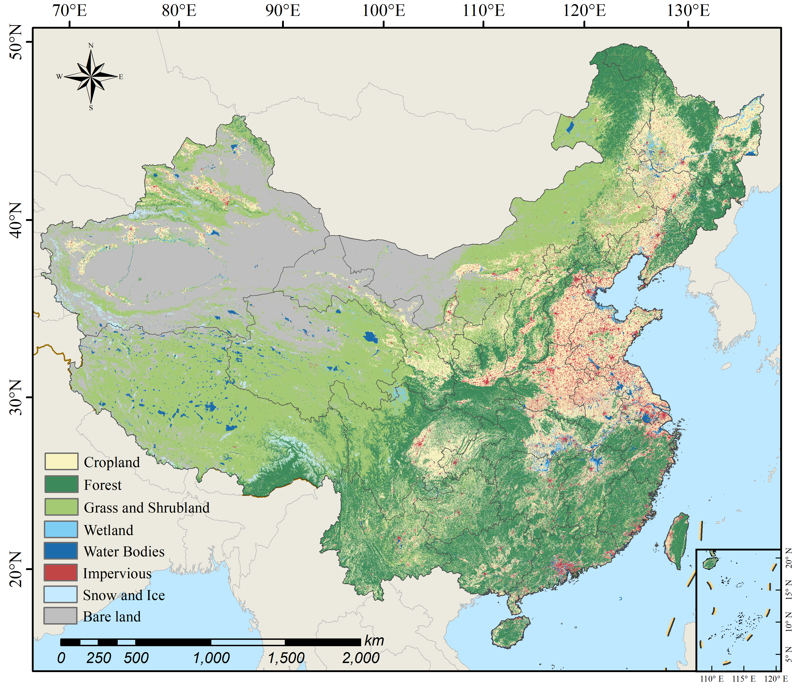

CRLC: Cross-resolution national-scale land-cover mapping based on noisy label learning: a case study of China
=
CRLC are the 10-meter resolution land cover maps for China in 2020 achieved by a deep classification network.

The maps include eight land cover classes:

1: Cropland

2: Forest

3: Grass/shrubland

5: Wetland

6: Water bodies

8: Impervious

9: Bareland

10: Snow/ice

[Google Drive](https://drive.google.com/drive/folders/1YwsFQmYNoC3wAG2AugLXGXwoonLep0u7?usp=share_link)

[Zenodo](https://zenodo.org/record/7745603#.ZC54CXYzYuU)

The dataset is provided for research purposes only. If you use this dataset in your research, please cite the following article:

Liu, Yinhe, et al. "Cross-resolution national-scale land-cover mapping based on noisy label learning: A case study of China." International Journal of Applied Earth Observation and Geoinformation 118 (2023): 103265.